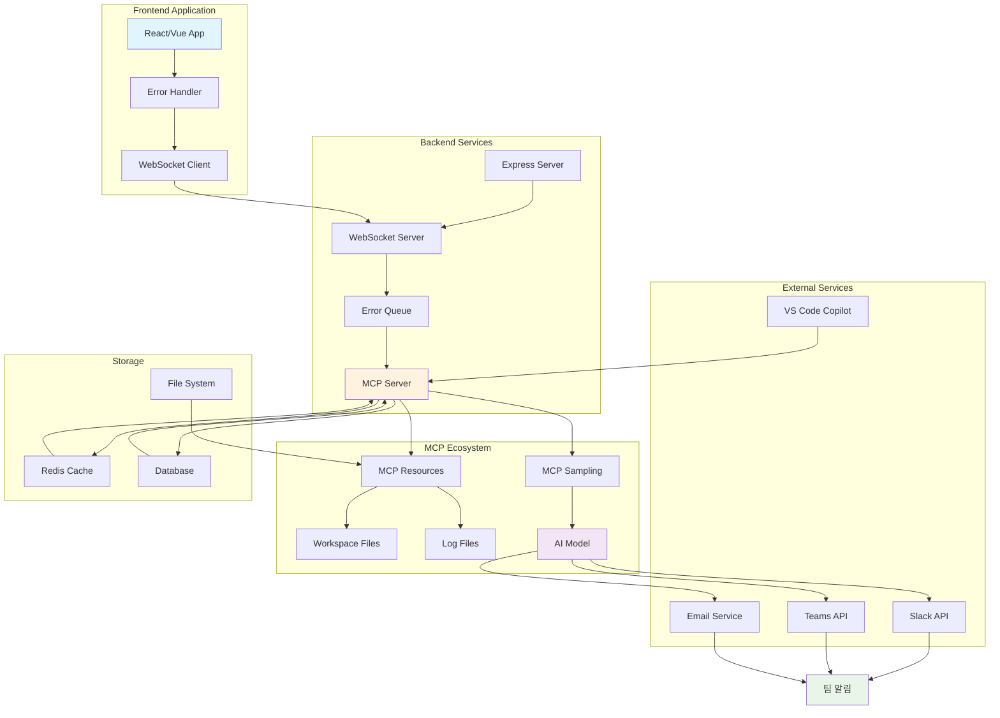
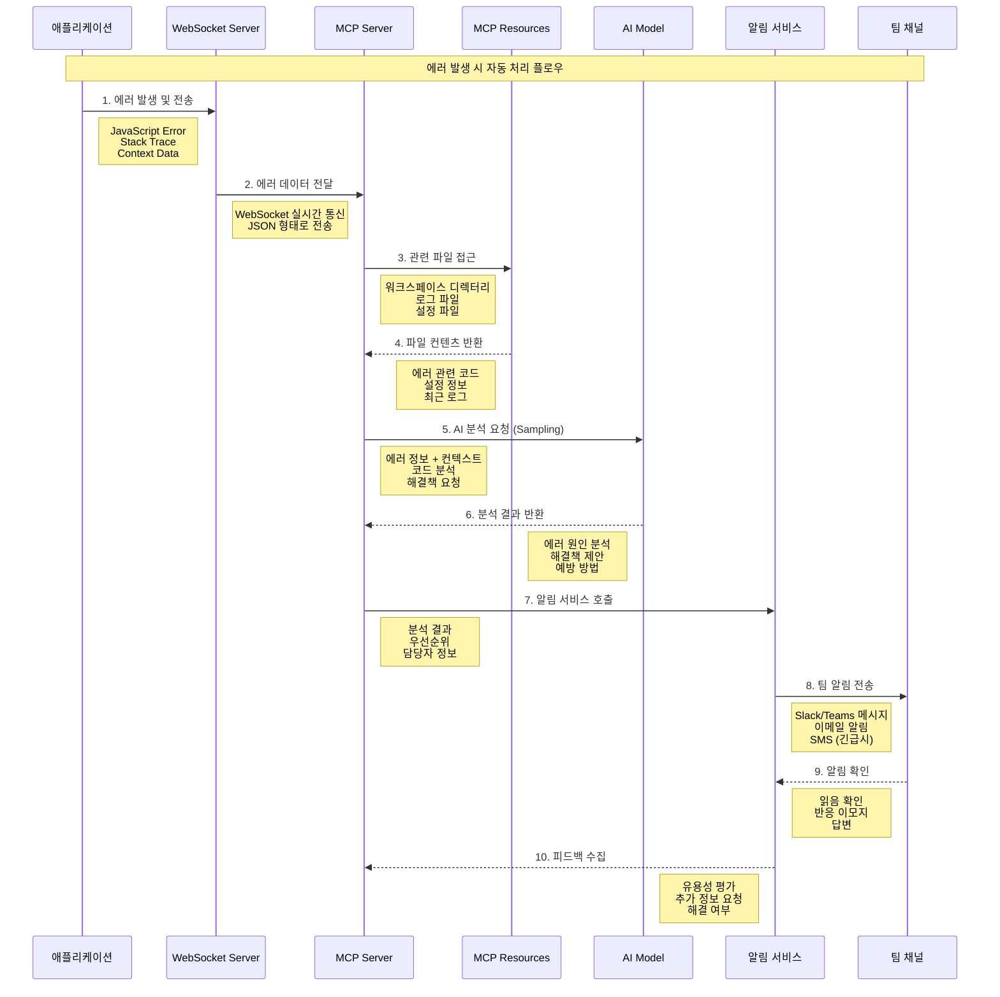
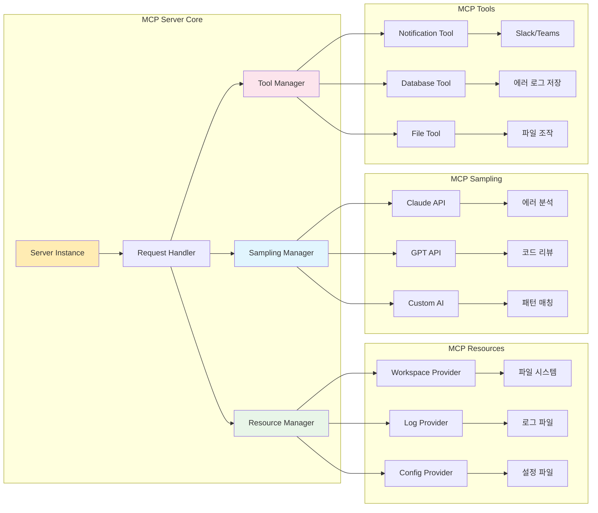
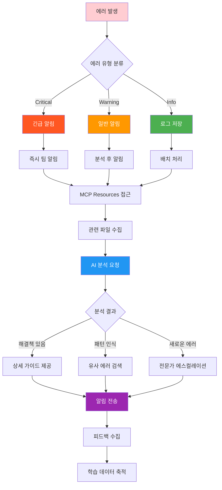
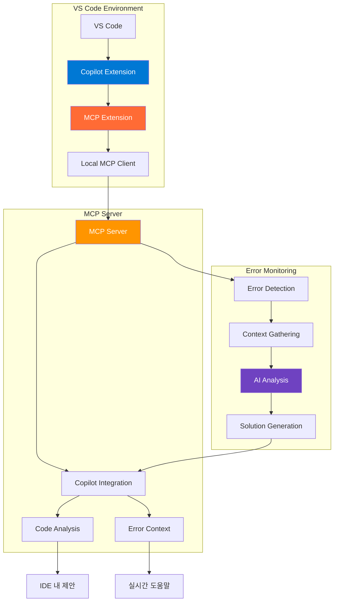
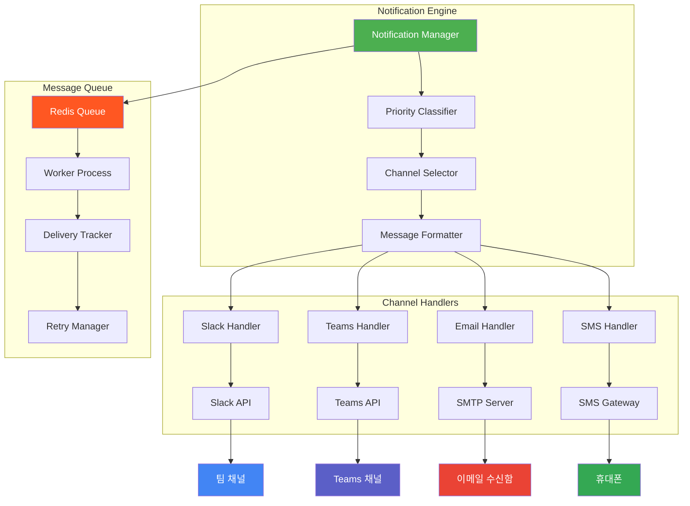
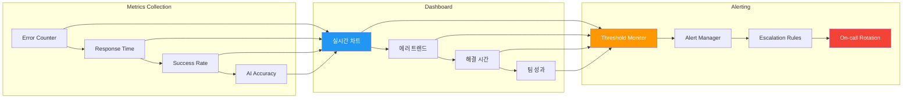

# MCP 에러 모니터링 시스템 아키텍처 다이어그램

## 전체 시스템 아키텍처

```mermaid
graph TB
    subgraph "Frontend Application"
        A[React/Vue App] --> B[Error Handler]
        B --> C[WebSocket Client]
    end
    
    subgraph "Backend Services"
        D[Express Server] --> E[WebSocket Server]
        E --> F[Error Queue]
        F --> G[MCP Server]
    end
    
    subgraph "MCP Ecosystem"
        G --> H[MCP Resources]
        G --> I[MCP Sampling]
        H --> J[Workspace Files]
        H --> K[Log Files]
        I --> L[AI Model]
    end
    
    subgraph "External Services"
        M[VS Code Copilot] --> G
        L --> N[Slack API]
        L --> O[Teams API]
        L --> P[Email Service]
    end
    
    subgraph "Storage"
        Q[Redis Cache] --> G
        R[Database] --> G
        S[File System] --> H
    end
    
    C --> E
    G --> Q
    G --> R
    N --> T[팀 알림]
    O --> T
    P --> T
    
    style A fill:#e1f5fe
    style G fill:#fff3e0
    style L fill:#f3e5f5
    style T fill:#e8f5e8
```

## 데이터 플로우 시퀀스

```mermaid
sequenceDiagram
    participant App as 애플리케이션
    participant WS as WebSocket Server
    participant MCP as MCP Server
    participant Resources as MCP Resources
    participant AI as AI Model
    participant Notify as 알림 서비스
    participant Team as 팀 채널

    Note over App,Team: 에러 발생 시 자동 처리 플로우
    
    App->>WS: 1. 에러 발생 및 전송
    Note right of App: JavaScript Error<br/>Stack Trace<br/>Context Data
    
    WS->>MCP: 2. 에러 데이터 전달
    Note right of WS: WebSocket 실시간 통신<br/>JSON 형태로 전송
    
    MCP->>Resources: 3. 관련 파일 접근
    Note right of MCP: 워크스페이스 디렉터리<br/>로그 파일<br/>설정 파일
    
    Resources-->>MCP: 4. 파일 컨텐츠 반환
    Note left of Resources: 에러 관련 코드<br/>설정 정보<br/>최근 로그
    
    MCP->>AI: 5. AI 분석 요청 (Sampling)
    Note right of MCP: 에러 정보 + 컨텍스트<br/>코드 분석<br/>해결책 요청
    
    AI-->>MCP: 6. 분석 결과 반환
    Note left of AI: 에러 원인 분석<br/>해결책 제안<br/>예방 방법
    
    MCP->>Notify: 7. 알림 서비스 호출
    Note right of MCP: 분석 결과<br/>우선순위<br/>담당자 정보
    
    Notify->>Team: 8. 팀 알림 전송
    Note right of Notify: Slack/Teams 메시지<br/>이메일 알림<br/>SMS (긴급시)
    
    Team-->>Notify: 9. 알림 확인
    Note left of Team: 읽음 확인<br/>반응 이모지<br/>답변
    
    Notify-->>MCP: 10. 피드백 수집
    Note left of Notify: 유용성 평가<br/>추가 정보 요청<br/>해결 여부
```

## MCP 컴포넌트 상세 구조

```mermaid
graph LR
    subgraph "MCP Server Core"
        A[Server Instance] --> B[Request Handler]
        B --> C[Resource Manager]
        B --> D[Sampling Manager]
        B --> E[Tool Manager]
    end
    
    subgraph "MCP Resources"
        C --> F[Workspace Provider]
        C --> G[Log Provider]
        C --> H[Config Provider]
        F --> I[파일 시스템]
        G --> J[로그 파일]
        H --> K[설정 파일]
    end
    
    subgraph "MCP Sampling"
        D --> L[Claude API]
        D --> M[GPT API]
        D --> N[Custom AI]
        L --> O[에러 분석]
        M --> P[코드 리뷰]
        N --> Q[패턴 매칭]
    end
    
    subgraph "MCP Tools"
        E --> R[Notification Tool]
        E --> S[Database Tool]
        E --> T[File Tool]
        R --> U[Slack/Teams]
        S --> V[에러 로그 저장]
        T --> W[파일 조작]
    end
    
    style A fill:#ffecb3
    style C fill:#e8f5e8
    style D fill:#e1f5fe
    style E fill:#fce4ec
```

## 에러 처리 워크플로우

```mermaid
flowchart TD
    A[에러 발생] --> B{에러 유형 분류}
    
    B -->|Critical| C[긴급 알림]
    B -->|Warning| D[일반 알림]
    B -->|Info| E[로그 저장]
    
    C --> F[즉시 팀 알림]
    D --> G[분석 후 알림]
    E --> H[배치 처리]
    
    F --> I[MCP Resources 접근]
    G --> I
    H --> I
    
    I --> J[관련 파일 수집]
    J --> K[AI 분석 요청]
    
    K --> L{분석 결과}
    L -->|해결책 있음| M[상세 가이드 제공]
    L -->|패턴 인식| N[유사 에러 검색]
    L -->|새로운 에러| O[전문가 에스컬레이션]
    
    M --> P[알림 전송]
    N --> P
    O --> P
    
    P --> Q[피드백 수집]
    Q --> R[학습 데이터 축적]
    
    style A fill:#ffcdd2
    style C fill:#ff5722,color:#fff
    style D fill:#ff9800,color:#fff
    style E fill:#4caf50,color:#fff
    style K fill:#2196f3,color:#fff
    style P fill:#9c27b0,color:#fff
```

## VS Code Copilot 통합

```mermaid
graph TD
    subgraph "VS Code Environment"
        A[VS Code] --> B[Copilot Extension]
        B --> C[MCP Extension]
        C --> D[Local MCP Client]
    end
    
    subgraph "MCP Server"
        E[MCP Server] --> F[Copilot Integration]
        F --> G[Code Analysis]
        F --> H[Error Context]
    end
    
    subgraph "Error Monitoring"
        I[Error Detection] --> J[Context Gathering]
        J --> K[AI Analysis]
        K --> L[Solution Generation]
    end
    
    D --> E
    E --> I
    L --> F
    G --> M[IDE 내 제안]
    H --> N[실시간 도움말]
    
    style B fill:#0078d4,color:#fff
    style C fill:#ff6b35,color:#fff
    style E fill:#ff9500,color:#fff
    style K fill:#6f42c1,color:#fff
```

## 알림 시스템 아키텍처

```mermaid
graph TB
    subgraph "Notification Engine"
        A[Notification Manager] --> B[Priority Classifier]
        B --> C[Channel Selector]
        C --> D[Message Formatter]
    end
    
    subgraph "Channel Handlers"
        E[Slack Handler] --> F[Slack API]
        G[Teams Handler] --> H[Teams API]
        I[Email Handler] --> J[SMTP Server]
        K[SMS Handler] --> L[SMS Gateway]
    end
    
    subgraph "Message Queue"
        M[Redis Queue] --> N[Worker Process]
        N --> O[Delivery Tracker]
        O --> P[Retry Manager]
    end
    
    D --> E
    D --> G
    D --> I
    D --> K
    
    A --> M
    F --> Q[팀 채널]
    H --> R[Teams 채널]
    J --> S[이메일 수신함]
    L --> T[휴대폰]
    
    style A fill:#4caf50,color:#fff
    style M fill:#ff5722,color:#fff
    style Q fill:#4285f4,color:#fff
    style R fill:#5b5fc7,color:#fff
    style S fill:#ea4335,color:#fff
    style T fill:#34a853,color:#fff
```

## 성능 모니터링 대시보드

```mermaid
graph LR
    subgraph "Metrics Collection"
        A[Error Counter] --> B[Response Time]
        B --> C[Success Rate]
        C --> D[AI Accuracy]
    end
    
    subgraph "Dashboard"
        E[실시간 차트] --> F[에러 트렌드]
        F --> G[해결 시간]
        G --> H[팀 성과]
    end
    
    subgraph "Alerting"
        I[Threshold Monitor] --> J[Alert Manager]
        J --> K[Escalation Rules]
        K --> L[On-call Rotation]
    end
    
    A --> E
    B --> E
    C --> E
    D --> E
    
    E --> I
    F --> I
    G --> I
    H --> I
    
    style E fill:#2196f3,color:#fff
    style I fill:#ff9800,color:#fff
    style L fill:#f44336,color:#fff
```